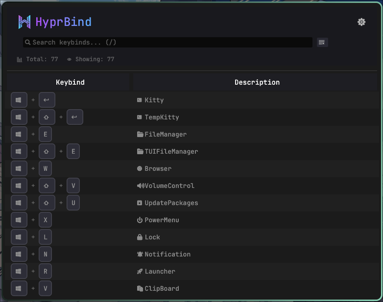

# HyprBind – Hyprland Keybind Viewer


A fast, minimal GUI to view Hyprland keybinds parsed from `hyprctl binds`. Built with Rust + eframe/egui. No font setup required (Nerd Font embedded).


## Features

- Parse and display `hyprctl binds`
- Human‑readable modmask (e.g. `64+1 → SUPER+SHIFT`)
- Fast searchable table (focus with `/`)
- Column sorting (asc → desc → none)
- Show/Hide columns (Keybind / Description / Command)
- Resizable columns with sensible minimums
- Compact Dark/Light theme toggle
- ZEN mode: hide header/search/stats to focus on the table; exit with `Z`
- Nerd Font icons bundled (modifiers, arrows, media keys, etc.)


## Screenshot




## Requirements

- Linux + Hyprland running
- `hyprctl` available in PATH
- Rust toolchain (to build from source)


## Install / Build

```bash
# Clone
git clone https://github.com/ry2x/HyprBind.git
cd show-hyprland-show-keybind

# Build & run (debug)
cargo run

# Build release
cargo build --release
```


## Usage

- Start the app. It will run `hyprctl binds`, parse the output, and show the table.
- Press `/` to focus the search bar; typing filters in real time.
- Click column headers to sort (asc/desc/none).
- Drag column borders to resize.
- Open Options (gear icon):
  - Switch theme (Dark/Light)
  - Choose visible columns and search targets
  - Enable ZEN mode; a modal appears once. Press `Z` to exit


## Add descriptions to your keybinds

Descriptions are taken from `bindd` entries. Example in your Hyprland config:
> [!NOTE]
> The documentation for hyprland config is [here](https://wiki.hypr.land/Configuring/Binds/#bind-flags)

```ini
bindd = SUPER, Return, Terminal, exec, kitty
bindd = SUPER+SHIFT, Q, Kill active window, killactive,
```

Plain `bind` also works but `description` will be empty:

```ini
bind = SUPER, F, exec, thunar  # description is empty
```


## Notes

- In dev builds, you might see a transient "Unaligned" overlay while resizing columns. This is an egui debug hint and does not appear in release builds.
- For very long keybinds/commands, overflowing text is clipped by the column; hover to see the full command.


## Config

- Config file: `~/.config/hyprbind/config.json`
- Preferences are saved automatically on change and loaded on startup

## Planning

- Export keybinds (JSON)
- Custom color schemes (Support Matugen themes)


## Tech

- eframe/egui + egui_extras (TableBuilder)
- image (embedded logo)
- nerd_font (embedded Nerd Font data)


## License

MIT.