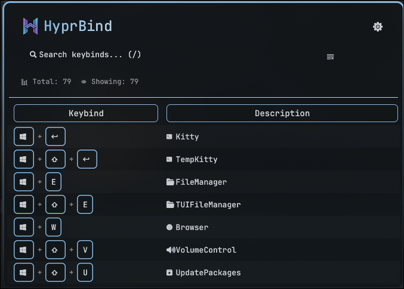
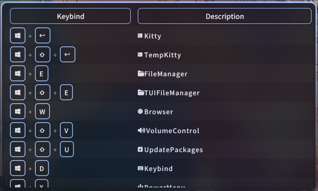

# HyprBind – Hyprland Keybind Viewer


A fast, minimal GUI to view Hyprland keybinds parsed from `hyprctl binds`. Built with Rust + eframe/egui.

## Screenshot



## Requirements

- Linux + Hyprland running
- `hyprctl` available in PATH
- Rust toolchain: `cargo` (to build from source)

## Install / Build

```bash
# Clone
git clone https://github.com/ry2x/HyprBind.git
cd HyprBind

# Build & run (debug)
cargo run

# Build release
cargo build --release

# for arch linux, this project has PKGBUILD
makepkg -si
```

- For Arch Linux users, you can also download prebuilt package from [releases page](https://github.com/ry2x/HyprBind/releases).

```bash
# After downloading from releases
sudo pacman -U hyprbind-<tag>-x86_64.pkg.tar.zst
```

## Usage

- Start the app. It will run `hyprctl binds`, parse the output, and show the table.
- Press `/` to focus the search bar; typing filters in real time.
- Click column headers to sort (asc/desc/none).
- Drag column borders to resize.
- Open Options (gear icon):
  - Switch theme (Dark/Light)
  - Choose visible columns and search targets
  - Enable ZEN mode; a modal appears once. Press `Z` to exit (info modal: Enter to close)
  - Press ESC to close Options

    <details>

    <summary>👉 What Zen Mode Looks Like</summary>

    

    </details>


## Add descriptions to your keybinds

> [!NOTE]
> The documentation for hyprland config is [here](https://wiki.hypr.land/Configuring/Binds/#bind-flags)

Descriptions are taken from `bindd` entries. Example in your Hyprland config:

```ini
bindd = SUPER, Return, Terminal, exec, kitty # description is "Terminal"
bindd = SUPER+SHIFT, Q, Kill active window, killactive # description is "Kill active window"
```

Plain `bind` also works but `description` will be empty:

```ini
bind = SUPER, F, exec, thunar  # description is empty
```

## Notes

- In dev builds, you might see a transient "Unaligned" overlay while resizing columns. This is an egui debug hint and does not appear in release builds.
- For very long keybinds/commands, overflowing text is clipped by the column; hover to see the full command.

## JSON output

- Print keybinds as JSON and exit:

  ```bash
  cargo run -- --json
  ```

  - or after installing:

  ```bash
  hyprbind --json
  ```

## dmenu output

- Print keybinds in dmenu-compatible format and exit:

  ```bash
  cargo run -- --dmenu
  ```

  - or after installing:

  ```bash
  hyprbind --dmenu
  ```

  - Usage with dmenu:

  ```bash
  hyprbind --dmenu | dmenu -l 20
  ```

## Config

- Config file: `$XDG_CONFIG_HOME/hyprbind/config.json` (fallback: `~/.config/hyprbind/config.json`)
- Preferences are saved automatically on change and loaded on startup

## Styling(CSS)

- Dark and Light themes available
- Custom CSS support (CSS theme will override built-in themes)
  - CSS path: `$XDG_CONFIG_HOME/hyprbind/hyprbind-theme.css` (fallback: `~/.config/hyprbind/hyprbind-theme.css`)
  - Generate default CSS:

  ```bash
  # default
  hyprbind --write-default-css

  # force overwrite
  hyprbind --force-write-default-css
  ```

  - Sample: [`hyprbind-theme.sample.css`](hyprbind-theme.sample.css)
  - Modify and save the CSS file, the app will auto-reload the CSS: Matugen or pywal etc..
    - Example matugen templete is here: [template in my dotfile](https://github.com/ry2x/Ryprland-dot/blob/master/matugen/.config/matugen/templates/hyprbind-theme.css)

> [!NOTE]
> `@import` is NOT supported in hyprbind's css.

## Contributions

**Contributions are welcome! Feel free to open issues or PRs on GitHub**

## Tech

- eframe/egui + egui_extras (TableBuilder)
- image (embedded logo)
- nerd_font (embedded Nerd Font data)

## License

SourceCode: MIT

Font: SIL OFL 1.1
